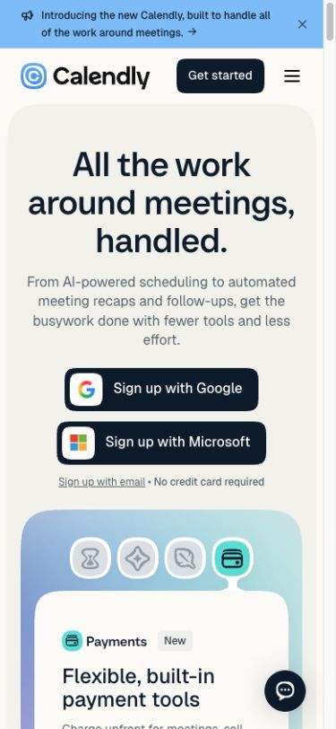
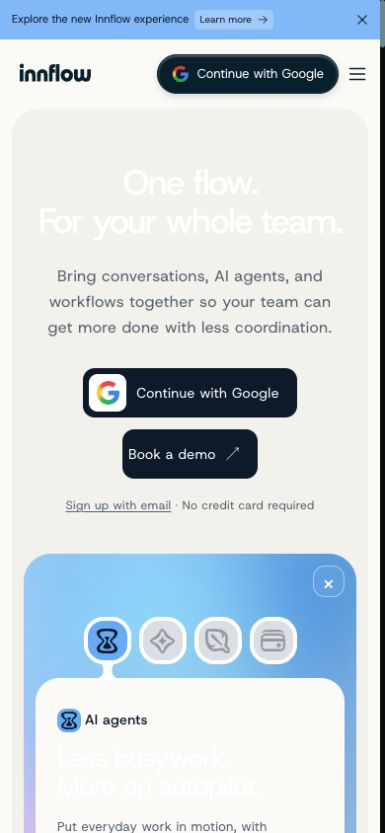
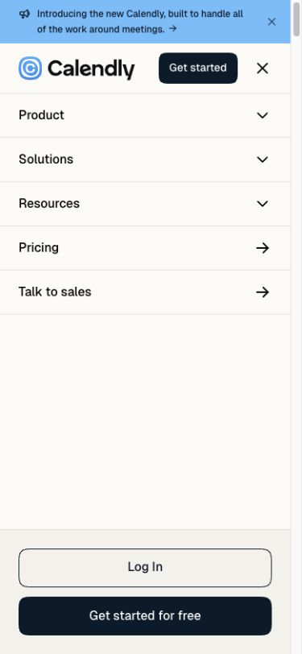
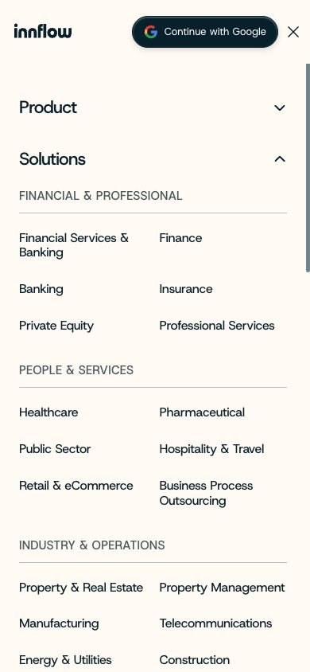
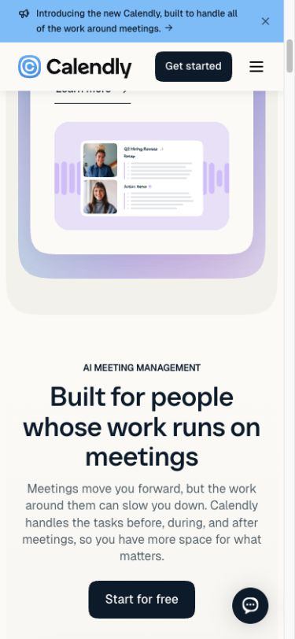
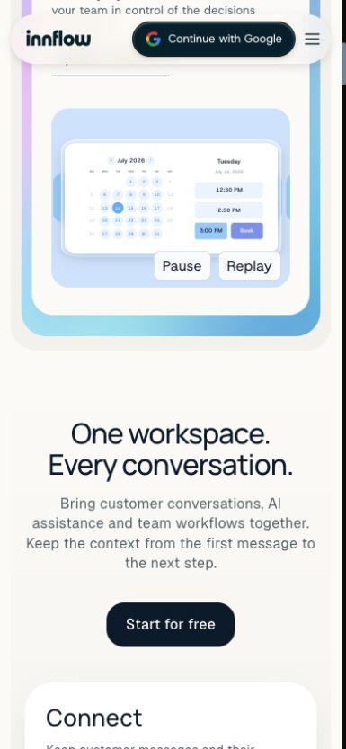
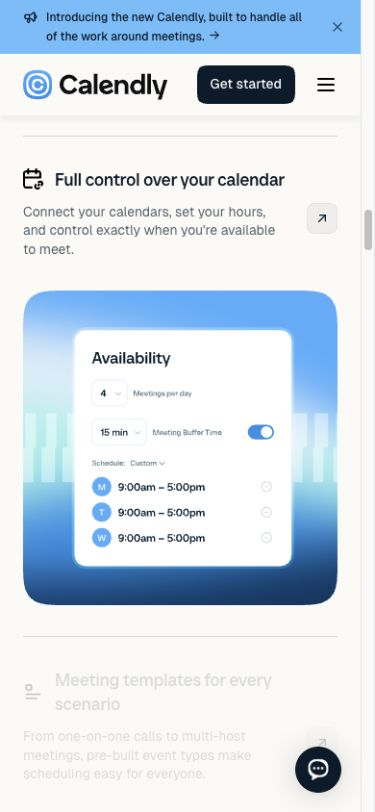
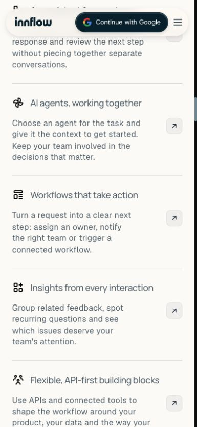

# Mobile homepage comparison

Captured live in Chrome at 390 × 844 on 2026-09-24. Scope: hero, navigation, showcase, and early feature sections. No changes made.

## 1. Hero: Innflow needs a contrast fix

Innflow's hero and showcase headings render white on cream. The DOM reports rgb(255, 255, 255) at full opacity, and the issue persisted across captures. Calendly uses dark headings. Fix this before visual polish. Keep the cream surfaces, rounded cards and generous spacing. Consider a more specific hero such as “Conversations, agents, and workflows. Connected.”

## 2. Navigation: works, but simplify density

Calendly uses a compact Get started action, short menu rows with separators, and distinct login/signup actions. Innflow repeats Google sign-in and expands Solutions into a long two-column industry list. Keep all industry pages, but use collapsible category groups and a prominent Browse all industries link. Allow wrapping and generous touch targets.

## 3. Showcase: good foundation, weak discoverability

Both use colorful rounded cards and four icon tabs. Innflow's first AI agents panel shows a calendar, which better communicates scheduling. Match the first illustration to an agent task. Add persistent short labels under icons; neither site is an ideal model for icon-only discoverability. Keep Innflow's pause/replay controls, but make their styling quieter without shrinking tap targets.

## 4. Feature detail: highest layout opportunity

Calendly places a substantial visual immediately below the feature explanation. Innflow's Communication section shows a long succession of text rows before the shared visual. On mobile, pair the active feature's explanation and demo, then show remaining feature titles as expandable rows. Preserve the desktop layout.

## Priority

1. Restore dark text for cream-background hero/showcase headings.
2. Pair mobile feature copy and illustration.
3. Use a compact header CTA and simplify industry-menu scanning.
4. Make tab labels visible and align the AI agents visual with its label.

## Limits

This is a mobile-width Chrome inspection, not a physical iPhone/Safari, performance, screen-reader or complete accessibility audit. No conversion flows were submitted. Lower-page and footer interactions were not fully audited. No cookie overlay appeared in this browser session. Final colors and focus/tap behavior need validation after implementation.
